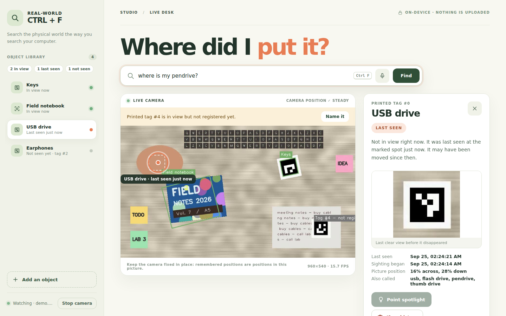

# REAL-WORLD CTRL+F

**What if you could search your desk the way you search your laptop?**

A webcam watches your desk. It recognises the objects you have registered, remembers **where each one was last seen**, and lets you search for them by name in a browser. An optional ESP32 pan/tilt LED can then point at that spot.

Everything runs on your own computer. No account, no cloud, no AI API key.

> **Honest scope.** The app finds *specific objects you registered*, not "any phone" or "any keys".
> Printed tags (ArUco markers) are the dependable way. Recognising an object **without** a tag works for
> flat, textured, matte things (book covers, boxes, printed coasters) and poorly for plain, shiny,
> transparent or very 3-D things (a black phone, a USB stick, earphones).
> A **last-seen** location is where the camera last saw it, **not** a promise that it is still there.

---

## Hybrid Spatial Memory (experimental Grok mode)

This branch adds a second memory layer alongside the deterministic desk tracker:

- **Laptop eye:** the fixed webcam keeps doing local tracking. You can manually analyze one current frame with Grok, or opt into passive semantic discovery. Passive mode only submits a changed still frame at most once every 30 seconds; it does **not** upload continuous video.
- **Mobile eye:** start the server with `--lan-scan`, enable the phone scanner at `/hybrid`, then open the generated secret URL on a phone connected to the same private Wi-Fi. Capture several overlapping room photos and label only the **zone** (for example `bedroom`, `shelf`, `desk`). Grok names the visible objects automatically.
- **Semantic memory:** Grok results are stored in `data/hybrid/semantic.sqlite3`. The app records object name, common aliases, visual description, confidence, source, zone, relative location hint and model. Optional cropped evidence images live in `data/hybrid/evidence/`.
- **No API key in the browser:** set `XAI_API_KEY` in the terminal environment before starting the app. The key is read only by the Python server.
- **Identity is conservative:** Grok can say “black wireless mouse” and generate a visible-trait signature, but that is **not proof** that a later identical-looking mouse is the exact same physical instance. Matching signatures may merge repeat sightings. Precise registered-object positions still come from the local tracker.

Current xAI image-understanding requests use the Responses API with `grok-4.7` by default. Override with `CTRLF_GROK_MODEL` if needed.

### Windows example

```powershell
$env:XAI_API_KEY="your_xai_key"
.\.venv\Scripts\python.exe server.py --lan-scan
```

Then open:

- main studio: `http://127.0.0.1:8765`
- hybrid dashboard: `http://127.0.0.1:8765/hybrid`

Press **Enable phone scanner** in the hybrid dashboard. The app creates a rotating secret LAN link for the phone. The normal studio remains blocked to LAN hosts.

Privacy note: Grok mode is opt-in. Only still images you explicitly scan, or sampled still frames while passive discovery is enabled, are sent to xAI. Full phone/laptop video is not uploaded by this implementation.

---

## 1. Install and start

You need Python 3.11 or newer and a webcam.

**Windows (PowerShell)** — open the folder that contains `server.py`:

```powershell
cd "$env:USERPROFILE\Downloads\real-world-ctrl-f"
py -m venv .venv
.\.venv\Scripts\python.exe -m pip install -r requirements.txt
.\.venv\Scripts\python.exe make_markers.py
.\.venv\Scripts\python.exe server.py
```

**macOS / Linux**

```bash
python3 -m venv .venv && source .venv/bin/activate
pip install -r requirements.txt
python make_markers.py
python server.py
```

Then open **http://127.0.0.1:8765** in your browser. Stop the app with `Ctrl+C` in the terminal.

Useful options:

| Option | What it does |
|---|---|
| `--camera 1` | use the second webcam (try this if the picture does not appear) |
| `--port 8766` | use another port if 8765 is busy |
| `--serial-port COM3` | connect the spotlight at start-up (you can also do it in the browser) |
| `--resolution 1280x720` | ask the camera for a larger picture (helps small objects, costs CPU) |
| `--no-autostart` | wait until you press **Start camera** |
| `--data-dir demo_data` | keep memory in another folder (e.g. for demos) |

Only one copy of the app can use the same data folder at a time; a second one refuses to start with a clear message.

---

## 2. Using the studio



*(Screenshot taken with the synthetic demo video, not a real webcam.)*

1. **Start the camera.** It starts automatically; the button in the lower left stops/starts it. Fix the camera on a stand looking down at the desk and **do not move it afterwards** — remembered positions are positions *in this picture*.
2. **Register objects** with **Add an object**:
   * **Use a printed tag** – most reliable. Stick a spare tag on the object, hold it in view, and name it. Any tag the camera sees but doesn't know also shows a yellow *“Name it”* banner.
   * **Draw around it** – the picture freezes; drag a **tight** box around the object (as little desk as possible) and name it. The app tells you if the object has too little surface detail.
3. **Watch it work.** Recognised objects get a labelled box on the video and a green dot in the library.
4. **Search.** Press **Ctrl+F** (or `/`) anywhere on the page, type e.g. *“where are my keys?”*, press Enter. Voice search (microphone button) is optional and uses your browser's speech service, which may send audio to its provider.
5. **Read the answer.** The panel on the right shows one of four states:

| State | Meaning | On the video |
|---|---|---|
| **In view now** | detected in the current picture | coloured box around it |
| **Last seen** | not visible now; last seen at the marked spot (it may have moved since) | pulsing ring + last box |
| **Uncertain location** | there is a remembered spot but a reason not to trust it (listed) | dashed amber ring |
| **Not seen yet** | registered but never observed | nothing |

   A location becomes **uncertain** when: the camera has moved since that sighting; the object was last seen at the edge of the picture (probably carried away); the sighting is older than 8 hours; a drawn object was only briefly or weakly recognised; several copies of the same tag were visible; or the record came from the older version of the app. Grey notes also say when the app was restarted in between or the camera is off.
6. **Last clear view.** A small photo of the object from just before it disappeared, to jog your memory.
7. **Remove / forget.** *Remove* deletes an object you created (template, history, photo). For the three built-in tags it becomes *Clear history*. **Clear all remembered locations** (Privacy card) wipes every position and photo but keeps the library.
8. **Another view.** For drawn objects, *Add another view* stores a second picture (e.g. the back of a book) – up to 4.

The desktop-only window is still available: `python app.py` (keys: `F` search, `1–9` select, `C` clear, `Q` quit). It uses the same engine, library and memory as the browser studio. Run one or the other, not both.

---

## 3. Printed tags

`make_markers.py` writes to `markers/`:

* `0_usb_drive.png`, `1_keys.png`, `2_earphones.png` – the three built-in objects (see `objects.json`)
* `spare_3.png` … `spare_8.png` – blank tags you can name from the browser
* `sheet_a4.png` – all of them on one A4 page. **Print at 100 % / “actual size”.** Default black square: 45 mm (`--size-mm 60` for bigger).

Tips: keep the white border visible, avoid glossy paper under bright lamps, and make the tag at least ~40 pixels wide in the camera picture. A tag **lying next to** an object only tracks the tag – attach it to the object.

---

## 4. Tag-free (“drawn”) objects – how it works and its limits

The app stores the pixels inside your box, separates the object from the background inside that box (OpenCV GrabCut) and keeps ORB feature points on the object. Every frame it looks for those features and accepts a match only if they form a geometrically consistent, plausibly shaped outline, cover a good part of the object **including its centre**, and appear in several consecutive frames.

Measured on the included synthetic benchmark (`python tools/benchmark_recognition.py`, 3 objects per desk scene, random rotation, 55–120 % scale, perspective, lighting changes, blur, JPEG, 50 % partly covered):

| matcher | recall | wrong place | false alarms (object absent) |
|---|---|---|---|
| original v0.2 | 11–19 % | 29–38 % | 36–53 % |
| **this version** | **59–64 %** | **0.5–3 %** | **0–6.5 %** |

These are *per single frame* and on *synthetic, flat* objects: they compare the two versions, they do **not** predict your webcam. The tracker additionally needs 3 consecutive matches before it shows an object, and tolerates short dropouts, which suppresses most single-frame errors. Also evaluated and **not** adopted because they did not help on the benchmark: contrast equalisation (CLAHE), SIFT (lower recall, ~4× slower), gridded features and region-of-interest tracking. No neural detector is included: generic detectors recognise categories (“cell phone”), not *your* phone, so they would add a large dependency without solving this problem.

Works well: book and notebook covers, printed boxes, packaging, board-game pieces with artwork, coasters, maps.
Works badly: plain or single-colour items, shiny/reflective (phones, glasses, metal), transparent, thin (cables, pens), very small, soft/deforming (clothes), and identical-looking items (two identical earbud cases).

**Enrol it where it lives**: on the desk, under the camera, with a tight box. Holding an object up in front of a laptop camera captures your face and hand as part of the “object”.

---

## 5. Visual memory – what is stored

Everything lives in `data/` (ignored by git):

| File | Contents |
|---|---|
| `locations.sqlite3` | one row per object: last-seen time, picture position/box, camera-position epoch, session, confidence |
| `snapshots/<id>.jpg` | small crop of the object's last clear view |
| `catalog.json` | names/aliases of your tags and drawn objects |
| `templates/<id>.png` + `.mask.png` | pictures of drawn objects and their object masks |
| `scene_reference.npz` | feature points of the empty scene (no image) used to notice camera movement |
| `spotlight.json` | your spotlight calibration |

Rules the memory follows:

* Positions are saved about once a second while an object is visible, and once more (with the photo) when it disappears. The time stored is the time of the **last actual detection**.
* The camera-position check runs about once a second. If the whole picture shifts or rotates consistently for a few seconds, a new *camera epoch* starts and every older position is shown as **uncertain**. Objects moving on the desk don't trigger this. With a blank, featureless view the check reports “can't verify” instead of guessing.
* After a restart, remembered positions stay; if the camera still sees the same scene they remain *last seen* (with a note that the app was not watching in between), otherwise they become uncertain.
* IDs of removed objects are never reused, so a new object can never inherit an old object's history.
* Data from the previous version is upgraded automatically (old positions are marked uncertain because they were recorded without the camera-position check; absolute file paths are repaired).

To erase everything, stop the app and delete the `data` folder.

---

## 6. Optional robotic spotlight (ESP32 + two servos + LED)

This is optional and **has not been validated on physical hardware by the author of these changes** – the firmware was compiled and its protocol tested on a PC with stand-in Arduino headers only. Calibrate before relying on it.

**Parts:** ESP32 dev board, two hobby servos (e.g. SG90/MG90S), a pan/tilt bracket, a low-power LED with a transistor/MOSFET driver and resistor, a separate 5 V supply (≥ 2 A) for the servos, jumper wires.

| ESP32 pin | Connects to |
|---|---|
| GPIO 18 | pan servo signal |
| GPIO 19 | tilt servo signal |
| GPIO 23 | LED driver input (not the LED directly) |
| GND | servo supply GND **and** LED driver GND (common ground) |

Safety: never power servos from the ESP32's 3.3 V pin; use only a low-power LED – **no lasers**, no mains lamps; keep eyes out of the beam; don't leave it running unattended. The firmware limits servo angles to 30–150°, moves smoothly instead of jumping, and turns the LED off by itself after 2 minutes without commands.

**Flash:** Arduino IDE → install *ESP32 board support* and the **ESP32Servo** library → open `firmware/spotlight/spotlight.ino` → select your board and port → Upload. Close the Serial Monitor afterwards (it blocks the port).

**Connect:** in the studio open **Robotic spotlight**, choose the port (Windows: `COM3`, …; Linux: `/dev/ttyUSB0`; macOS: `/dev/cu.usbserial-…`) and press **Connect**. The app waits for the board to answer (`READY`/`PONG`); with the old v1 firmware it still works but cannot confirm movements.

**Calibrate** (needed once per rig, and again if the camera or lamp moves):

1. Open **Calibrate**. Use the arrow pad (step 1/5/15°) to aim the light at the **top-left corner of the camera picture** on your desk, then press **Save top-left**.
2. Repeat for top-right, bottom-left, bottom-right.
3. Tick **Test: click the camera picture to aim there** and click around the video to check.

The mapping interpolates between the four corners. It is accurate for a flat desk with the lamp near the camera; tall objects and a lamp far from the camera give larger errors. Calibration is saved to `data/spotlight.json` (the repository's `spotlight.json` only holds placeholder values, flagged `"placeholder": true`).

Serial protocol (115200 baud): `?` → `PONG CTRLF-SPOTLIGHT 2`, `P,<pan>,<tilt>` → `OK P,<pan>,<tilt>` (applied angles), `L,1`/`L,0`, `H` (centre, light off); errors reply `ERR …`.

---

## 7. Try it without a webcam

```bash
python tools/make_demo_video.py              # writes demo_desk.mp4 (synthetic desk)
python server.py --camera demo_desk.mp4 --data-dir demo_data
```

The video contains the USB-drive and keys tags, an unregistered spare tag and a “Field Notes” cover you can enrol by drawing a box. It is for trying the interface; it says nothing about real-camera performance.

---

## 8. Troubleshooting

| Problem | Try |
|---|---|
| “The camera is not available” | Close Zoom/Teams/Camera app; try `--camera 1`; Windows: Settings → Privacy & security → Camera → allow desktop apps. |
| Tags are not detected | More light, less glare, bigger print, keep the white border, bring the camera closer. |
| Drawn object not found | Draw a tighter box, enrol it lying on the desk under the camera, add a second view, or use a printed tag. |
| Everything says “uncertain · camera moved” | The camera was bumped. Objects become reliable again as soon as they are seen. |
| “Can't verify camera position” | The view has too little detail (blank desk, dark room). Positions still work; the camera-move check just can't run. |
| “Another Real-World Ctrl+F window is already using …” | Close the other `server.py` / `app.py`. |
| Port 8765 busy | `python server.py --port 8766` |
| Spotlight: “Cannot open COM3” | Close Arduino Serial Monitor, check the port in Device Manager, replug USB. |
| Spotlight points to the wrong place | Calibrate the four corners; re-calibrate after moving the camera or the lamp. |

---

## 9. Tests

```bash
pip install -r requirements-dev.txt
python -m unittest discover -s tests -v
python tools/benchmark_recognition.py       # optional recognition benchmark
```

What is covered (all camera-free, using synthetic frames): tag detection and duplicates; name search (plurals, typos, no substring false matches); enrolment quality, rotation/scale/lighting, background false positives, multiple views, identity conflicts; confirmation over several frames, short dropouts, disappearance, reappearance, edge exits, stale records, camera-movement detection, restarts, upgrade of old data, data-folder locking; the HTTP API including validation and security checks; the real camera thread on a synthetic video; spotlight calibration and serial protocol with a fake port; the firmware source compiled for the PC (needs `g++`); front-end ↔ API consistency and the page's security policy; and, if Playwright is installed, a real-browser run that searches, enrols and removes an object.

Not covered: real webcams, real lighting, real objects, real ESP32/servos. Those need a physical test on your rig.

---

## 10. How the code is organised

```
 camera.py ──frames──▶ engine.py ──────────────▶ memory.py (SQLite, last-seen rows)
 (webcam/video,        ├─ tracker.py  (ArUco tags)      catalog.py (names, tags, drawn objects, search)
  reconnects)          ├─ vision.py   (drawn objects)   scene.py   (camera-moved watchdog)
                       └─ tracks + VISIBLE / LAST SEEN / UNCERTAIN / NOT SEEN
        server.py (FastAPI, 127.0.0.1 only) ◀─┘            app.py (OpenCV desktop window)
        ├─ web/ (browser studio)
        └─ spotlight.py ──serial──▶ firmware/spotlight/spotlight.ino (ESP32)
```

| File | Responsibility |
|---|---|
| `engine.py` | the one tracking engine shared by `server.py` and `app.py` |
| `vision.py` | tag-free recognition of enrolled objects |
| `tracker.py` | printed-tag detection (+ helpers kept for older scripts) |
| `catalog.py` | object library and local name search |
| `memory.py` | SQLite visual memory with automatic upgrades |
| `scene.py` | detects camera movement |
| `camera.py` | camera/video input thread with reconnects |
| `server.py` | local web API, security checks, MJPEG stream |
| `spotlight.py` | spotlight calibration and serial protocol |
| `web/` | browser studio (no external fonts or scripts) |
| `tools/` | recognition benchmark, demo-video generator |

## 11. Privacy and security

* The server listens on `127.0.0.1` only; frames are never uploaded.
* Other websites can't use it: requests with a foreign `Host` are refused (prevents DNS-rebinding), state-changing requests need a custom header and same origin, and a strict Content-Security-Policy / `Cross-Origin-Resource-Policy` stop other pages from embedding the camera stream.
* Only small crops of registered objects are saved, never video. Don't point the camera at documents or screens you don't want in those crops.

## 12. What to say in a demo

Say: *“A fixed webcam remembers where each registered object was last seen, tells you when that memory can't be trusted, and a small robotic lamp points at it.”*
Don't say: *“It always knows where every lost item is.”* A single camera can't see inside drawers or under books, and an object moved while hidden keeps its old position until it is seen again.
